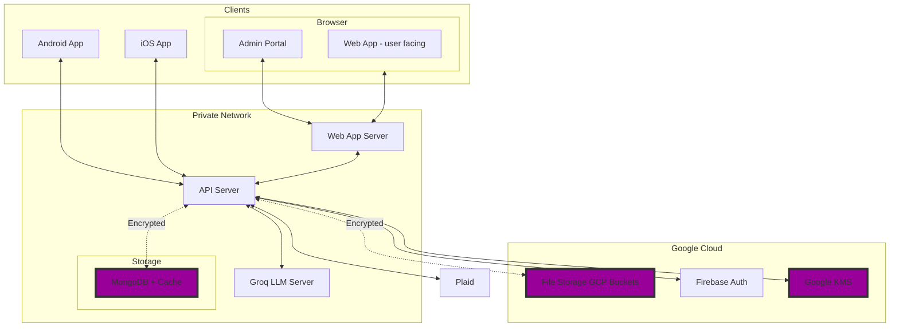

# Zentavos Architecture Diagram

Use

## Architecture Notes

### Overview

The Zentavos architecture is designed to support a multi-platform application with a focus on security and scalability. The architecture includes mobile applications for Android and iOS, a web application, and a robust backend infrastructure.

This architecture ensures a secure, scalable, and efficient system to support the Zentavos application across multiple platforms.

### Zero Trust Architecture

- **Public IPs**: Only the API Server and Web App Server have public IPs that are accessible from the internet. All other components are secured within a private network.
- **Encryption**: Both the database and file storage are encrypted at the user/row level and as a whole, ensuring data security.
- **Private Network**: The LLM Server, MongoDB, File Storage Server, Google Auth, and Google KMS are all within a private network, enhancing security.

### Data Flow

1. **Client Interaction**: Users interact with the Android App, iOS App, or Web Browser.
2. **API Requests**: Client requests are sent to the API Server.
3. **Data Processing**: The API Server processes requests, interacts with the MongoDB and File Storage Server, and retrieves necessary data.
4. **Security Checks**: The API Server interacts with Google Auth for authentication and Google KMS for encryption key management.
5. **AI Features**: For AI-related features, the API Server interacts with the LLM Server.
6. **Cache**: Check cache for financial data before calling Plaid. If no cached data or cache is outdated or otherwise invalidated.
7. **Financial Data**: The API Server interacts with Plaid to retrieve financial data.
8. **Response**: Processed data is sent back to the clients through the API Server.

### Cache

Financial data and any other costly data gets cached in the MongoDB for faster retrieval.

- Check the cache first before calling these.
- Recent financial transactions and balances are cached for 30 minutes.
- Financial transactions for the last 30 days are invalidated at the end of the day.
- A refresh button in the frontend can refresh the data.

## LLM

We're using [Groq](https://console.groq.com/docs/api-reference) as an LLM server.

# Zentavos Servers

| server    | Local IP     | External IP | Subdomain   | TCP Port | Description                |
| --------- | ------------ | ----------- | ----------- | -------- | -------------------------- |
| ZENDEVAPI | 192.168.7.20 | 38.70.71.43 | api-dev     | 443, 80  | API NodeJS (Development)   |
| ZENDEVLLM | 192.168.7.21 |             |             | 11434    | File Storage NodeJS (Dev)  |
| ZENDEVDB  | 192.168.7.22 |             |             | 28028    | MongoDB (Development)      |
| ZENDEVWEB | 192.168.7.23 | 38.70.71.42 | dev         | 80, 443  | Website (Development)      |
| ZENSTGAPI | 192.168.7.24 | 38.70.71.41 | api-staging | 443, 80  | API NodeJS (Staging)       |
| ZENSTGLLM | 192.168.7.25 |             |             | 11434    | File Storage NodeJS (Stg)  |
| ZENSTGDB  | 192.168.7.26 |             |             | 28028    | MongoDB (Staging)          |
| ZENSTGWEB | 192.168.7.27 | 38.70.71.40 | staging     | 80, 443  | Website (Staging)          |
| ZENPROAPI | 192.168.7.28 | 38.70.71.39 | api         | 443, 80  | API NodeJS (Production)    |
| ZENPROLLM | 192.168.7.29 |             |             | 11434    | File Storage NodeJS (Prod) |
| ZENPRODB  | 192.168.7.30 |             |             | 28028    | MongoDB (Production)       |
| ZENPROWEB | 192.168.7.31 | 38.70.71.38 | @           | 80, 443  | Website (Production)       |

---

### Note

SSH is only accessible locally and on port 228.
